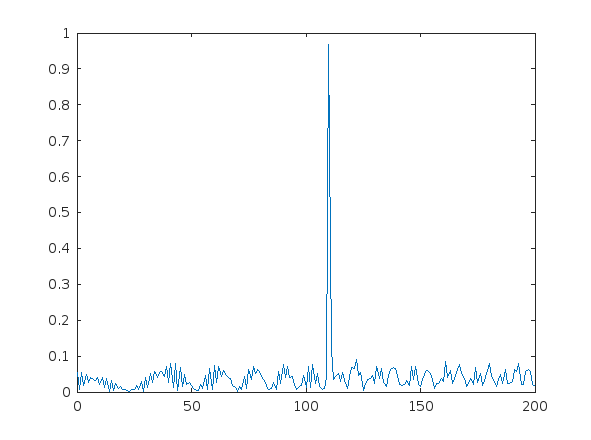
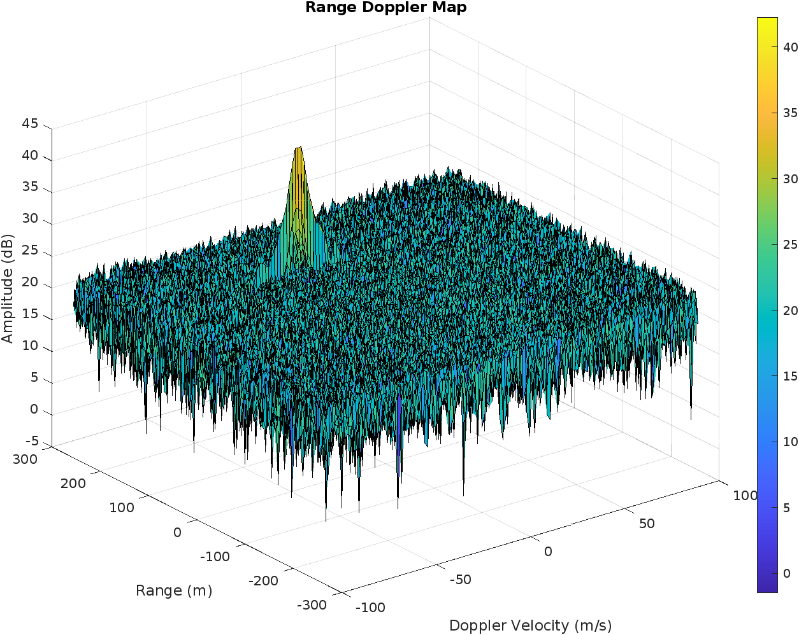
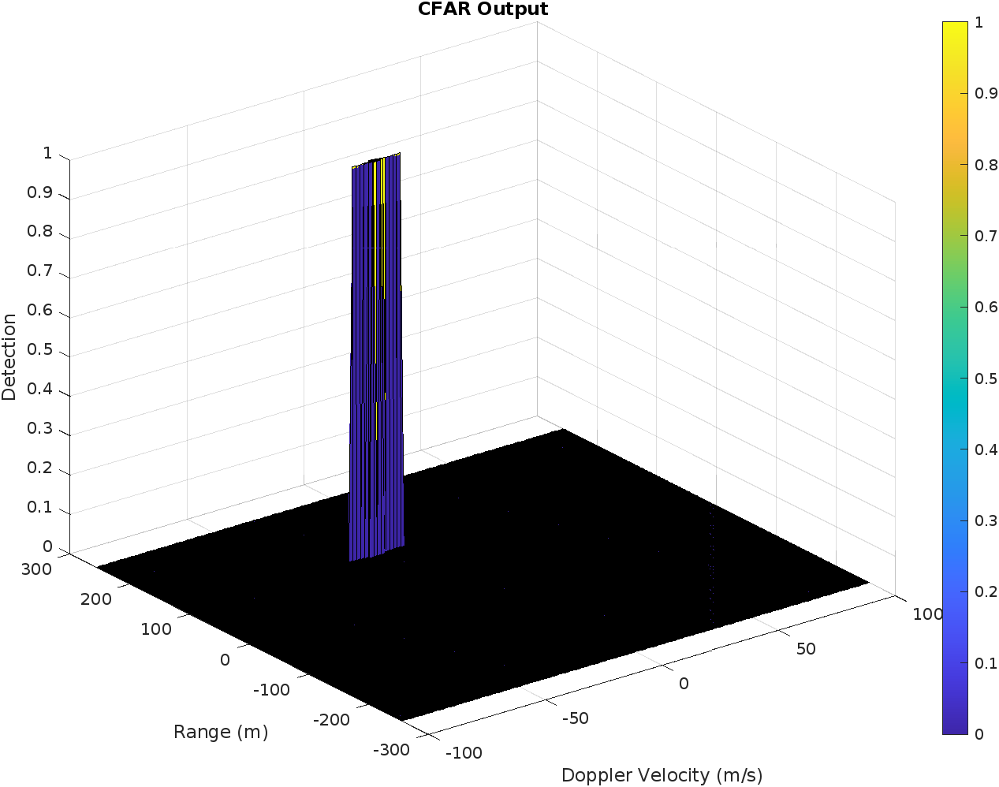

# Radar Target Generation and Detection

This project uses Matlab to introduce frequency modulated continuous-wave (FMCW) radar and related post-processing techniques. The topics covered include:
- Fast Fourier transforms (FFT) and 2 dimensional FFT
- Clutter v. Target
- Engineer chirp bandwith to meet system requirements for max resolution
- Phased array beam steering to determine angle of arrival (AoA)
- Noise suppression by applying Constant false alarm rate (CFAR)
- Signal-to-noise ratio (SNR) and dynamic thresholding

## Visualization of the results


## Installing Matlab
Instructions for installing the latest version of Matlab can be found at https://www.mathworks.com/

I used the onlin version that is provided by Udacity account.

## Project requirements and solution

In order to have a clean data storage a struct is used for both, the radar and the target.

### Radar Specicfication

| Specifications | Value |
:----:|:----:
|Frequency | 77 Ghz|
|Range Resolution | 1 m|
|Max Range | 200 m|
|Max velocity | 70 m/s|
|Velocity resolution| m m/s|

### Target Spoecification

| Specifications | Value |
:----:|:----:
| Velocity | -20 m/s | 
| Range | 110 m |

### FMCW Waveform Design

#### Using the given system requirements, design a FMCW waveform. Find its Bandwidth (B), chirp time (Tchirp) and slope of the chirp.
```
%% FMCW Waveform Generation

% Design the FMCW waveform by giving the specs of each of iradar.Ts parameters.
% Calculate the Bandwidth (B), Chirp Time (Tchirp) and Slope (slope) of the FMCW
% chirp using the requiremenradar.Ts above.

% radar bandwidth
radar.bsweep = c / (2 * radar.res_max);

% fitting factor
radar.fitting_factor = 5.5; % practical factor for fitting

% radar.Ts
radar.Ts = radar.fitting_factor * 2 * radar.range_max / c; 

% Slope
radar.chirp_slope = radar.bsweep / radar.Ts;
```

### Simulation Loop

#### Simulate Target movement and calculate the beat or mixed signal for every timestamp
For given system requirements the calculated slope should be around 2e13

### Range FFT (1st FFT)

#### Implement the Range FFT on the Beat or Mixed Signal and plot the result

A beat signal should be generated such that once range FFT implemented, it gives the correct range i.e the initial position of target assigned with an error margin of +/- 10 meters.

- Implement the 1D FFT on the Mixed Signal

```
% Timestamp for running the displacement scenario for every sample on each
% chirp
t=linspace(0,Nd*radar.Ts,Nr*Nd); %total time for samples


%Creating the vectors for Tx, Rx and Mix based on the total samples input.
Tx=zeros(1,length(t)); %transmitted signal
Rx=zeros(1,length(t)); %received signal
Mix = zeros(1,length(t)); %beat signal

%Similar vectors for range_covered and time delay.
r_t=zeros(1,length(t));
t_delta=zeros(1,length(t));


%% Signal generation and Moving Target simulation

% Running the radar scenario over the time. 
for i=1:length(t)         

    %For each time stamp update the Range of the Target for constant velocity.
    range = target.init_range + target.init_v*t(i)

    %For each time sample we need update the transmitted and
    %received signal. 
    t_delta= 2*range / c;
    t_new  = t(i)-t_delta;

    Tx(i) = cos( 2*pi*( radar.frequency_operational*t(i) + (0.5*radar.chirp_slope*t(i)^2) ) );
    Rx(i) = cos( 2*pi*( radar.frequency_operational*t_new + (0.5*radar.chirp_slope*t_new^2) ) );

    %Now by mixing the Transmit and Receive generate the beat signal
    %This is done by element wise matrix multiplication of Transmit and
    %Receiver Signal
    Mix(i) = Tx(i).*Rx(i);
    
end
```


- Reshape the vector into Nr*Nd array.
- Run the FFT on the beat signal along the range bins dimension (Nr)
- Normalize the FFT output with length, L = Bsweep * Tchirp.
- Take the absolute value of that output.
- Keep one half of the signal
- Plot the output
- There should be a peak at the initial position of the target. In our case at 110 m.

```
%reshape the vector into Nr*Nd array. Nr and Nd here would also define the size of
%Range and Doppler FFT respectively.
new_Mix = reshape(Mix,[Nr,Nd]);

%run the FFT on the beat signal along the range bins dimension (Nr) and
%normalize.
signal_fft = fft(new_Mix);

% Take the absolute value of FFT output
signal_fft = abs(signal_fft/max(max(signal_fft)));

% Output of FFT is double sided signal, but we are interested in only one side of the spectrum.
% Hence we throw out half of the samples.
signal = signal_fft(1:length(t)/2+1);   % Taking only half of output
```



### 2D CFAR

#### Implement the 2D CFAR process on the output of 2D FFT operation, i.e the Range Doppler Map
The 2D CFAR processing should be able to suppress the noise and separate the target signal. The output should match the image shared in walkthrough.

- first reshape to number of chirps and doppler cells
- use 2D FFT-function
- then only use positive signals
- use function RDM for the positives

```
% Range Doppler Map Generation.

% The output of the 2D FFT is an image that has reponse in the range and
% doppler FFT bins. So, it is important to convert the axis from bin sizes
% to range and doppler based on their Max values.

Mix=reshape(Mix,[Nr,Nd]);

% 2D FFT using the FFT size for both dimensions.
sig_fft2 = fft2(Mix,Nr,Nd);

% Taking just one side of signal from Range dimension.
sig_fft2 = sig_fft2(1:Nr/2,1:Nd);
sig_fft2 = fftshift(sig_fft2);
RDM = abs(sig_fft2);
RDM = 10*log10(RDM) ;

```



 - now let us use the CFAR method to eliminte noise by defining
     - training cells
     - guard cells
     - and the threshold to get rid of noise
 - create 2 additional matricies
     - threshold_cfar
     - signal_cfar
   to hold results of the cfar calculation and to set the signal
 - create helper values to keep the code clean
     - chirps_width
     - samples_width
     - num_cells

```
% Getting the dimensions
[m,n] = size(RDM);
% Vector to hold threshold values 
threshold_cfar = zeros(m,n);
%Vector to hold final signal after thresholding
signal_cfar = zeros(m,n);

% helpers
chirps_width = training_cells_chirps+guard_cells_chrips;
samples_width = training_cells_samples+guard_cells_samples;

% number of cells for averaging
num_cells = (2*chirps_width + 1)*(2*samples_width + 1) - (2*guard_cells_chrips + 1)*(2*guard_cells_samples + 1);

% loop for CUT
for i =  (chirps_width + 1):( m - 2*chirps_width)
    for j = (samples_width + 1):(n - 2*(samples_width))
        % loop to calculate cfar
        threshold_cfar(i,j) = sum(sum(db2pow(RDM(i-(chirps_width) : i+(chirps_width),j-(samples_width) : j+(samples_width))))); 
        threshold_cfar(i,j) = threshold_cfar(i,j) - sum(sum(db2pow(RDM((i-guard_cells_chrips):(i+guard_cells_chrips),(j-guard_cells_samples):(j+guard_cells_samples)))));
        
        threshold_cfar(i,j) = threshold_cfar(i,j)/num_cells;
        % calculate the threshold
        threshold_cfar(i,j) = offset_threshold + pow2db(threshold_cfar(i,j));
        
        if RDM(i,j) > threshold_cfar(i,j)
            signal_cfar(i,j) = 1;
        else
            signal_cfar(i,j) = 0;
        end
        
    end
end
```


